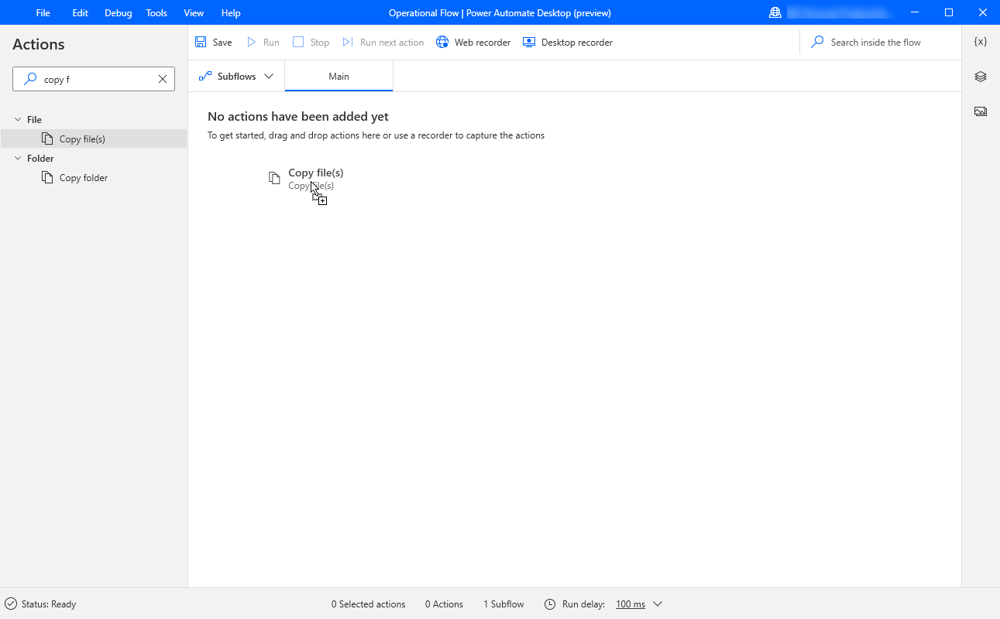
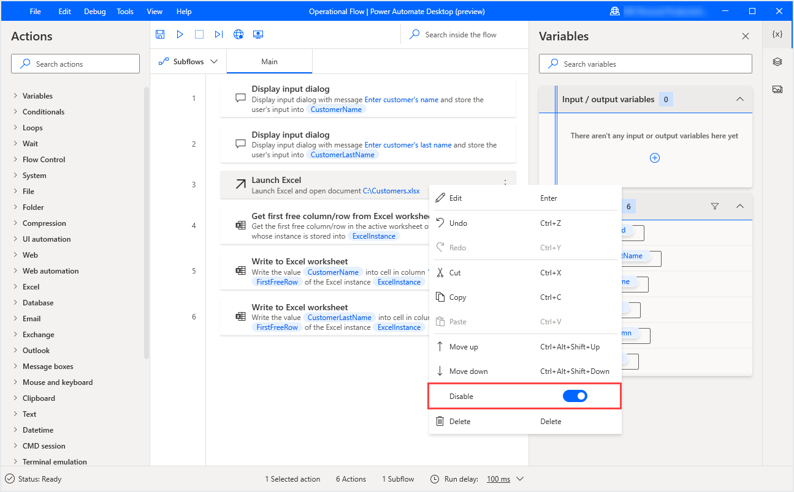
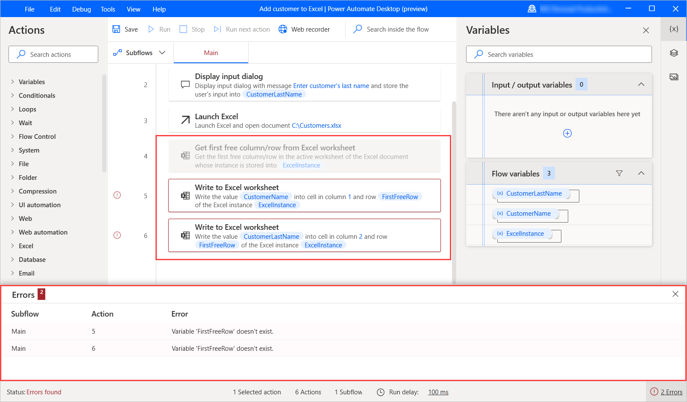

# 작업과 작업창 구성

[!INCLUDE [cc-beta-prerelease-disclaimer.md](../../includes/cc-beta-prerelease-disclaimer.md)]

흐름 디자이너를 열면, 창 왼편에 있는 작업창에서 모든 작업 그룹을 볼 수 있습니다.

특정 작업을 빨리 검색하려면 검색창에 작업 이름을 입력하세요. 일부 일치하는 결과도 검색이 가능합니다.

## 작업공간에 작업 추가하기

흐름 개발을 시작하려면, 작업을 선택후 더블클릭하시거나 끌어서(드래그해서) 작업공간에 이동하셔도 됩니다.

작업 매개변수를 가진 대화 박스가 열립니다. 작업은 변수 이름과 같은 특정 매개변수와 기본 값을 갖고 있습니다. 다른 작업들은 시작하기 위해 사용자의 입력을 요구합니다. **저장(Save)** 을 선택하면, 작업이 작업공간에 나타납니다.

## 작업 구성

파워 오토메이트 데스크톱(Power Automate Desktop) 작업은 두가지 주요 부분으로 구성되어 있습니다.
- 입력 매개변수 - 텍스트 영역, 드롭다운 메뉴와 체크박스 형태
- 생성된 변수 - 자동으로 생성된 변수

입력 매개변수는 작업이 처리할 함수와 입력으로 가져올 데이터를 결정합니다. 해당 데이터는 하드코딩된 값일 수도 있고 변수일 수도 있습니다. 

변수를 매개변수로 사용하려면, 해당 영역의 오른편에 있는 아이콘을 선택해서 해당되는 변수를 정하면 됩니다.

각 영역은 숫자, 텍스트 또는 리스트와 같은 특정 데이터 타입을 수용할 수 있습니다. 만일 값이나 변수가 맞지 않는 타입이 입력된다면, 작업은 에러를 발생합니다. 

생성된 변수는 나중에 사용하기 위해 작업의 결과물을 유지합니다. 모든 생성된 변수는 작업 속성(action's properties) 아랫 부분에 표시됩니다. 

각 생성된 변수들은 해당 데이터에의해 정의된 데이터 타입을 띱니다. **변수(Variables)** 창에서 변수의 데이터 타입을 보실 수 있습니다. 데이터 타입에 관한 더 많은 정보는 [해당 문서](variable-data-types.md)에서 확인하세요.

생성된 변수가 나중에 필요하지 않은 경우, 왼편에 있는 아이콘 가운데 **필요없음(Not needed)** 을 선택하시면 됩니다. 

## Configuring action exceptions

When an action throws an exception, the flow stops its execution by default. To configure a custom error handling behavior for an action, select the **On error** option in its properties.

The dialog box first option is the **Retry action if an error occurs** checkbox, which makes the flow execute the action one more time after two seconds.

To continue the flow's execution, even if the retry option fails, select the **Continue flow run** option. Through the ​drop-down list, you can:

- **Go to next action**: Executes the following action in order.
- **Repeat action**: Repeats the action until it runs successfully. 
- **Go to label**: Continues the execution from a point defined by a **Label** action.

Power Automate Desktop offers two additional error handling options. Select the **New rule** button to:
- **Set variable**: Sets the desired value to a specified variable.
- **Run subflow**: Executes a specified subflow. 

If different errors require different error handling behaviors, select the **Advanced** option and configure each possible error separately. 

## Enabling and disabling actions

To disable or enable an action, right-click on it and select **Disable action** or **Enable Action**, respectively. 

Disabling an action allows you to remove it from the flow without erasing it. This feature is commonly applied to test different versions of a flow and decide which one is the most efficient. 

When an action is disabled, all variables defined in it are hidden from the **Variables** pane. If the hidden variables are used in other actions, the flow may throw an error. 

In the example below, two actions threw an error because they contain variables defined in a disabled action.

