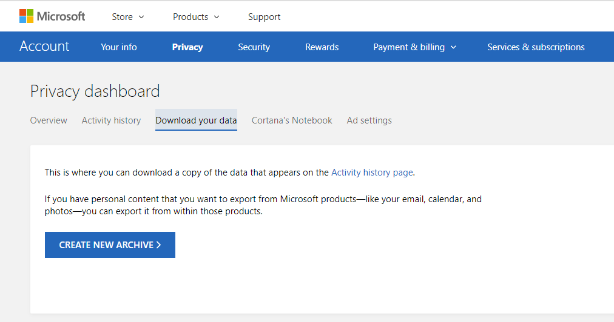
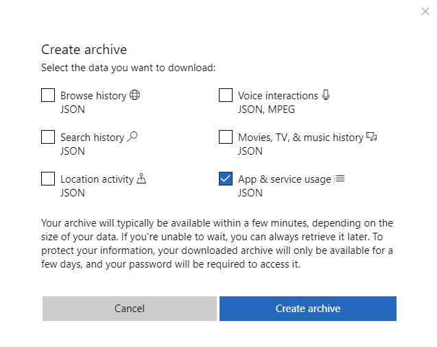

# Responding to GDPR Data Subject Export Requests for Microsoft Flow - Microsoft Accounts (MSA)

As part of our commitment to partner with you on your journey to the General Data Protection Regulation (GDPR), we’ve developed documentation to help you prepare. The documentation not only describes what we’re doing to prepare for the GDPR but also shares examples of steps you can take today with Microsoft to support GDPR compliance when using Microsoft Flow.

## Manage Export requests

The *right of data portability* allows a data subject to request a copy of their personal data in an electronic format (that’s a “structured, commonly used, machine readable, and interoperable format”) that may be transmitted to another data controller.

Microsoft Flow offers the following experiences to find or export personal data for a specific user:

* **Website access:** sign into the [Microsoft Privacy Dashboard](https://account.microsoft.com/privacy/), or the [Microsoft Flow Website](https://flow.microsoft.com/).

|**Personal data**|**Website access**|
|-----------------|-------------------|
|Product and service activity|Microsoft Privacy Dashboard|
|Flows|Microsoft Flow Maker Portal|
|Run history|Microsoft Flow Maker Portal|
|Activity Feed|Microsoft Flow Maker Portal|
|Connections|Microsoft Flow Maker Portal|

## Export Product and Service Activity
1. Sign into the [Microsoft Privacy Dashboard](https://account.microsoft.com/privacy/) using your Microsoft Account.
1. Click on **Activity history** link.
    
1. You can browse your activity history for the different Microsoft applications and services that you use.
1. To export **Product and Service Activity** data click on the **Download your data** link and then click on **Create New Archive** button.
 

 1. Check **App & service usage** and then click **Create archive** button.
 
1. A new archive will get created. Click on **Download** link to obtain your exported Product and Service Activity data.

## Export a flow

An end user who has access to the flow, can export the flow by following these steps:

1. Sign into [Microsoft Flow](https://flow.microsoft.com/).

1. Select the **My flows** link, and then select the flow to export.

1. Select **… More**, and then select **Export**.

    

1. Select **Package (.zip)**.

Your flow will now be available as a zipped package. For more information, see the blog post about [how to export and import a flow](https://flow.microsoft.com/blog/import-export-bap-packages/).

## Export run history

Run history includes a list of all executions that have occurred for a flow. This data includes the flow’s status, start time, duration, and input/output data for triggers and actions.

An end user who has access to the flow can follow these steps to export this data:

1. Sign into [Microsoft Flow](https://flow.microsoft.com/).
1. Select the **My flows** link, and then select the flow for which you want to export the run history.
1. In the **RUN HISTORY** pane, select **See all**.

    

1. Select **Download CSV**.

    

The run history is downloaded as a .csv file so that you can open it in Microsoft Excel or a text editor and further analyze the results.

## Export a user's activity feed

In [Microsoft Flow](https://flow.microsoft.com/), the activity feed shows a user’s history of activities, failures and notifications. A user can view their activity feed by following these steps:

1. Sign into [Microsoft Flow](http://flow.microsoft.com/), select the bell icon near the upper-right corner, and then select **Show all activity**.

    

1. In the **Activity** screen, copy the results, and then paste them into a document editor such as Microsoft Word.

    

## Export a user’s connections

Connections allow flows to connect to APIs, SaaS applications, and other third-party systems. Follow these steps to view your connections:

1. Sign into [Microsoft Flow](http://flow.microsoft.com/), select the gear icon near the upper-right corner, and then select **Connections**.

    
1. Copy the results, and then paste them into a document editor such as Microsoft Word.

